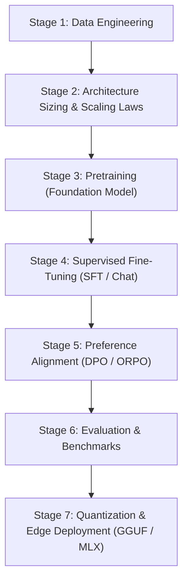

# Master Roadmap: End-to-End LLM Training & Development Plan

This document outlines the systematic, engineering-grounded blueprint for evolving our custom PyTorch Transformer into a capable, instruction-following language model.

---

## High-Level Lifecycle



---

## Phase 1: Data Engineering & Dataset Strategy

A model is only as good as its training distribution. Modern frontier models allocate 80% of effort to dataset quality and filtering rather than architectural tweaks.

### 1. Pretraining Data Recipe
For models under 1 Billion parameters, training on generic web scrape (Common Crawl) results in mediocre reasoning. Instead, use high-signal, educational data:

| Dataset | Type | Tokens | Purpose |
| :--- | :--- | :--- | :--- |
| **HuggingFace FineWeb-Edu** (Sample/10BT) | High-quality educational web | 1B – 10B | World knowledge, factual reasoning |
| **TinyStories** | Synthetic children's stories | ~500M | Grammatical syntax, character consistency, fluent prose |
| **StarCoder / The Stack (Python subset)** | Code & algorithms | 1B – 2B | Logical structuring, syntax, indentation, reasoning |
| **Open-Web-Math / SmolLM-Corpus** | Math & structured QA | 500M – 1B | Mathematical and step-by-step reasoning |

### 2. Zero-Copy Sharding Pipeline
Expand `data/prepare_data.py` to stream and shard large datasets into 100MB chunk files (`shard_00000.bin`, `shard_00001.bin`):
- Memory-mapped reading prevents OOM errors even on a laptop with 8GB–16GB RAM.
- Byte-level tokenization ensures zero out-of-vocabulary (`<unk>`) issues.

---

## Phase 2: Compute Scaling Laws & Sizing

According to the **Chinchilla Scaling Laws** (Hoffmann et al., DeepMind):
$$\text{Compute-Optimal Tokens} \approx 20 \times \text{Parameters}$$

For small models, **overtraining** (training on 50x–100x tokens beyond Chinchilla optimal, like LLaMA 3 and SmolLM) yields significantly higher inference performance per parameter:

| Model Tier | Parameters | Target Context | Chinchilla Tokens | Overtrained Tokens | Estimated Train Time (M-Series Mac MPS) | Estimated Train Time (1x RTX 4090 / A100) |
| :--- | :--- | :--- | :--- | :--- | :--- | :--- |
| **Pico** (`tiny`) | **17M** | 512 | 340M | 1 Billion | ~4–8 hours | ~30 minutes |
| **Nano** (`small`) | **65M** | 1,024 | 1.3B | 3–5 Billion | ~1–2 days | ~4–6 hours |
| **Micro** (`base`) | **150M** | 2,048 | 3.0B | 10 Billion | ~5–7 days | ~16–24 hours |
| **Edge-1B** | **1.0B** | 4,096 | 20B | 50+ Billion | Cloud recommended | ~3–5 days (Multi-GPU) |

---

## Phase 3: Pretraining Optimization Recipe

Pretraining turns random weights into a foundation model that predicts next tokens with high grammatical and contextual fluency.

### Optimization Hyperparameters
- **Optimizer**: AdamW ($\beta_1 = 0.9, \beta_2 = 0.95, \epsilon = 10^{-8}$)
- **Weight Decay**: $0.1$ applied strictly to 2D tensors (linear weights, embeddings); $0.0$ for biases and RMSNorm scalars.
- **Learning Rate Schedule**:
  - **Warmup**: Linear warmup for the first 1%–2% of total steps.
  - **Decay**: Cosine decay down to $10\%$ of peak learning rate ($\text{min\_lr} = 0.1 \times \text{max\_lr}$).
  - Peak LR guidelines:
    - 17M: $6.0 \times 10^{-4}$
    - 65M: $4.0 \times 10^{-4}$
    - 150M: $3.0 \times 10^{-4}$
- **Gradient Clipping**: Clip global gradient norm to $1.0$ to avoid destabilizing loss spikes.
- **Precision**: `bfloat16` (Apple Silicon MPS / Ampere+ GPUs) or `float16` with dynamic loss scaling.

### Monitoring Metrics
- **Cross-Entropy Loss**: Should steadily decrease from $\sim 10.8$ down to $2.2–2.8$.
- **Perplexity ($e^{\text{loss}}$)**: Aim for perplexity $< 15$ on validation sets.
- **Gradient Norm**: Sudden spikes indicate bad training batches or excessive LR.

---

## Phase 4: Supervised Fine-Tuning (SFT / Chat)

A pretrained base model only acts as a text completer (it will generate more questions when asked a question). SFT transforms it into an interactive conversational assistant.

### 1. Chat Template & Special Tokens
Add conversational special tokens to our tokenizer:
- `<|im_start|>user\n{prompt}<|im_end|>\n<|im_start|>assistant\n{response}<|im_end|>`

### 2. Loss Masking (Critical)
Only compute cross-entropy loss on the **assistant's tokens**!
- Mask the user's prompt tokens with `-100` (`ignore_index` in `torch.nn.functional.cross_entropy`).
- This prevents the model from wasting capacity trying to predict what human questions look like.

### 3. High-Quality Instruction Datasets
- **SmolTalk** / **UltraChat-200k**: High-signal multi-turn conversations.
- **OpenHermes-2.5** / **Magpie-Reasoning**: Deep chain-of-thought and coding.
- Training duration: 2 to 3 epochs over 50,000–200,000 instruction pairs.

---

## Phase 5: Preference Alignment (DPO)

Direct Preference Optimization (**DPO**) aligns the model with human preferences (conciseness, truthfulness, safety, avoiding repetition) without needing a separate reinforcement learning reward model (RLHF).

### DPO Loss Function
$$\mathcal{L}_{\text{DPO}}(\theta; \theta_{\text{ref}}) = -\mathbb{E}_{(x, y_w, y_l)} \left[ \log \sigma \left( \beta \log \frac{\pi_\theta(y_w \mid x)}{\pi_{\text{ref}}(y_w \mid x)} - \beta \log \frac{\pi_\theta(y_l \mid x)}{\pi_{\text{ref}}(y_l \mid x)} \right) \right]$$

- $y_w$: Chosen (winning) response.
- $y_l$: Rejected (losing) response.
- $\pi_{\text{ref}}$: Frozen weights of the model after SFT.
- Dataset: **UltraFeedback-Binarized** or **Argilla DPO mix**.

---

## Phase 6: Automated Evaluation & Benchmarks

Establish standard evaluation harness tests:
1. **Perplexity on WikiText-2 & Lambada**: Measures general language modeling quality.
2. **ARC-Easy & ARC-Challenge**: Common-sense reasoning.
3. **GSM8K-lite**: Multi-step math reasoning.
4. **HumanEval-Python**: Code generation pass@1.

---

## Phase 7: Quantization & Edge Deployment

Once weights are trained, make the model run lightning-fast on consumer devices:

1. **GGUF Export**:
   - Convert PyTorch `.pt` weights to `.gguf`.
   - Apply **4-bit quantization (Q4_K_M)** or **8-bit (Q8_0)**.
   - Run in `llama.cpp`, Ollama, or native C/C++ runtimes.
2. **Apple MLX / CoreML**:
   - Export directly to Apple Silicon unified memory for native macOS/iOS execution at $> 60$ tokens/sec with minimal battery consumption.
3. **Android ExecuTorch / ONNX Runtime**:
   - Quantize to INT4 / INT8 and load into mobile apps without cloud dependencies.

---

## Action Plan: Step-by-Step Implementation Modules

```text
Step 1: Dataset Streaming Pipeline
├── data/stream_dataset.py       -> Stream FineWeb-Edu / TinyStories from HuggingFace
└── data/shard_writer.py         -> Multi-threaded binary sharder

Step 2: Scaling Pretraining
├── train/train_distributed.py   -> DDP / Multi-GPU support (torchrun)
└── scripts/run_pretrain.sh      -> Automated background training script with logging

Step 3: Post-Training (SFT & DPO)
├── train/sft_dataset.py         -> Chat format parser with prompt token masking
├── train/train_sft.py           -> Supervised instruction tuning trainer
└── train/train_dpo.py           -> Direct Preference Optimization trainer

Step 4: Quantization & Export
├── export/export_gguf.py        -> Export PyTorch weights to GGUF format
└── export/export_mlx.py         -> Native Apple MLX conversion
```
