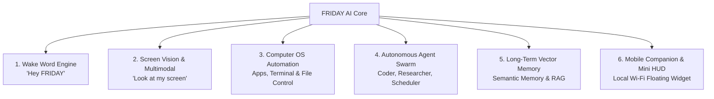

# FRIDAY — Master Future Roadmap & Innovation Blueprint

> **Vision**: Transform FRIDAY from an AI chatbot into an autonomous **AI Operating Assistant & Computer Control Companion** capable of voice command, visual screen understanding, agentic workflow execution, and lifelong memory.

---

## 🌟 6 Groundbreaking Feature Proposals

---

## 1. 🎙️ Always-On Voice Wake Word ("Hey FRIDAY")
- **Technology**: `openWakeWord` (100% offline, zero-latency, free) or `Picovoice Porcupine`.
- **How It Works**:
  - Runs an ultra-lightweight background thread listening specifically for the phonetic signature of *"Hey FRIDAY"* with `< 1%` CPU usage.
  - When triggered, it flashes the **Scarlet Core** into active soundwave mode and opens the audio channel without needing to tap the mic button.

---

## 2. 👁️ Screen Vision & Multimodal Context ("Look at this")
- **Technology**: Fast screen capture + Multimodal LLMs (Claude 3.5 Sonnet / GPT-4o / Qwen2-VL / MiniCPM-V).
- **Use Cases**:
  - *"FRIDAY, look at my terminal and tell me why this build failed."*
  - *"Summarize the graph on my screen."*
  - *"Refactor the code visible in my IDE."*

---

## 3. 🖥️ Native Computer OS Automation & Agentic Tools
- **Technology**: Python `pyobjc` (macOS native automation), AppleScript, `psutil`, `playwright`.
- **Capabilities**:
  - **System Control**: Adjust volume, toggle Do Not Disturb, switch workspaces, control Spotify/media playback.
  - **Dev Automation**: *"Create a new FastAPI project in my Projects folder, initialize git, and open VS Code."*
  - **Browser Automation**: *"Find the latest tech news on HackerNews and summarize the top 3 stories."*

---

## 4. 🤖 Autonomous Specialized Agent Swarm
- **Architecture**: Orchestrated sub-agents with dedicated tools:
  1. **🛡️ The Coder Agent**: Writes code, runs unit tests in a sandbox, fixes errors autonomously.
  2. **🔍 The Researcher Agent**: Crawls live search engines, parses GitHub repos, synthesizes technical briefs.
  3. **📅 The Executive Assistant**: Syncs with Google Calendar, tracks deadlines, reads and drafts emails.

---

## 5. 🧠 Persistent Long-Term Memory (RAG + SQLite-Vec)
- **Technology**: `sqlite-vec` or `ChromaDB` with local embeddings (`sentence-transformers/all-MiniLM-L6-v2`).
- **Capabilities**:
  - FRIDAY remembers your preferred tech stack, personal projects, frequently used workflows, and favorite music playlists across infinite sessions.
  - Query: *"What was the database schema we decided on last week?"* ➔ Instant exact recall.

---

## 6. 📱 Floating Mini HUD & Mobile Companion App
- **Desktop Floating Overlay**:
  - A discreet, transparent glowing widget on your macOS menu bar / desktop corner with a live 4-dot voice spectrum.
- **Local Wi-Fi Mobile Node**:
  - Connect your smartphone on the same Wi-Fi network as a remote wireless microphone and speaker.

---

## 📅 Suggested Phased Implementation Timeline

| Phase | Milestone | Focus Areas | Key Deliverables |
|---|---|---|---|
| **Phase 2 (Next)** | **Intelligent Voice & Tools** | Wake Word & OS Tool Execution | Offline "Hey FRIDAY" trigger, native app launch, Spotify control, volume/system tools. |
| **Phase 3** | **Vision & Multimodal** | Screen Awareness | Screen capture API, OCR, visual debugging assistant with Claude/GPT-4o vision. |
| **Phase 4** | **Local Memory (RAG)** | Long-Term Recall | `sqlite-vec` embedding store, user profile memory, project knowledge bases. |
| **Phase 5** | **Agent Swarms & Automation** | Autonomous Multi-Agent | Coder agent, browser web crawler agent, multi-step goal planning. |
| **Phase 6** | **Ecosystem & Polish** | Mini HUD & Mobile Node | Transparent floating desktop pill, mobile remote voice companion. |
