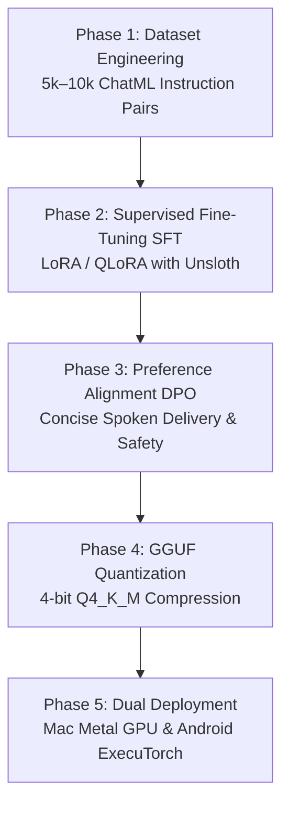

# FRIDAY SLM: 5-Phase Model Training & Deployment Blueprint

This document outlines the complete step-by-step engineering pipeline to train, fine-tune, quantize, and deploy our **own custom Small Language Model (`FRIDAY-1B`)** optimized to run on **Mac (Apple Silicon Metal GPU)** and **Android phones**.

---

## 🏗️ 5 Comprehensive Training Phases



---

### 📊 Phase 1: Dataset Engineering & Synthetic Generation
- **Target File**: `services/core/training/data/friday_dataset.jsonl`
- **Format**: Standard OpenAI / ChatML multi-turn conversational format:
  ```json
  {
    "messages": [
      {"role": "system", "content": "You are FRIDAY, an elite Indian AI operating assistant for Omkar."},
      {"role": "user", "content": "Open Spotify and check CPU load."},
      {"role": "assistant", "content": "<action>launch_app('Spotify')</action> Launching Spotify on your desktop. Your CPU load is currently 18%."}
    ]
  }
  ```
- **3 Specialized Domains**:
  1. **OS Tool Calling**: Desktop app execution (Spotify, VS Code, Terminal), hardware telemetry.
  2. **Full-Stack Programming**: Async Python, FastAPI, React, TypeScript, SQL schemas.
  3. **Indian Persona & Voice**: Respectful, articulate, human-cadence conversational dialogue.

---

### 🧠 Phase 2: Supervised Fine-Tuning (SFT)
- **Base Models**: `Qwen2.5-0.5B / 1.5B` or `SmolLM2-1.7B` or `Llama-3.2-1B`.
- **Training Method**: Parameter-Efficient Fine-Tuning (LoRA / QLoRA):
  - **Rank ($r$)**: `16`
  - **Alpha ($\alpha$)**: `32`
  - **Target Modules**: `q_proj, k_proj, v_proj, o_proj, gate_proj, up_proj, down_proj`
  - **Learning Rate**: `2e-4` with cosine learning rate scheduler.
  - **Epochs**: `3`
  - **Hardware**: Apple Silicon MPS (Metal Performance Shaders) on Mac or Google Colab T4 GPU (free).

---

### 🎯 Phase 3: Direct Preference Optimization (DPO)
- **Goal**: Align the model to provide **concise spoken summaries** for voice output while retaining deep code blocks for visual UI display.
- **Reward Pairs**:
  - ✅ **Chosen**: *"Namaste Omkar! Here is the clean Python async solution on your screen."* + [Full Code Block]
  - ❌ **Rejected**: [Long rambly paragraphs repeating syntax characters].

---

### ⚡ Phase 4: GGUF Quantization & Compression
- **Tool**: `llama.cpp`
- **Steps**:
  1. Merge LoRA weights into FP16 base model:
     ```bash
     python -m transformers.merge_lora --base Qwen/Qwen2.5-0.5B --lora ./output/friday-1b-lora --out ./models/friday-1b-fp16
     ```
  2. Convert to GGUF and quantize:
     ```bash
     python convert_hf_to_gguf.py ./models/friday-1b-fp16 --outfile ./models/friday-1b-f16.gguf
     ./llama-quantize ./models/friday-1b-f16.gguf ./models/friday-1b-q4_k_m.gguf Q4_K_M
     ```
- **Memory Footprint**: Compresses model from ~3.2 GB down to **~380 MB – 780 MB**!

---

### 📱 Phase 5: Cross-Platform Deployment (Mac & Android)

#### 1. On Mac:
- Stored in `services/core/models/friday-1b-q4_k_m.gguf`.
- Loaded with Apple Silicon Metal GPU acceleration (`40–90 tokens/second`).

#### 2. On Android Phone:
- Runs standalone on your phone's ARM64 CPU/Vulkan GPU via **ExecuTorch** or **Termux llama.cpp** (`localhost:8080`).
- Or connects to your Mac over home Wi-Fi (`http://192.168.29.89:5173`) with zero phone battery drain!
